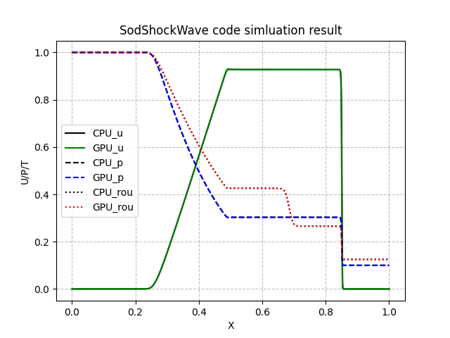

# SOD-ShockTube Solver

The Sod shock tube is a Riemann problem used as a standard test problem in CFD. This code solves the stand sod shock Tube problem using C++ and CUDA.

## Standard test case

In the standard case the density and pressure on the left are unity, and the density on the right side of the contact is 0.125 and the pressure is 0.1. The ratio of specific heats is 1.4.

## About the code

* CmakeList.txt:Cmake file used to configure and build the project
* src:the source code(inlcude CPU and GPU)
* test: run the code and process the simulation result

## Environmental requirements

* g++ (soupport C++17 and the version should be supported by cuda)
* cuda
* python3 (needing numpy and matplotlib)

## using method

1. cmake -B build
2. cd test && mkdir output
3. sh test.sh

(note: the simulation results are stored as one figure named SimulationResult.png, and more detailed data can be found in test/output)

## result

